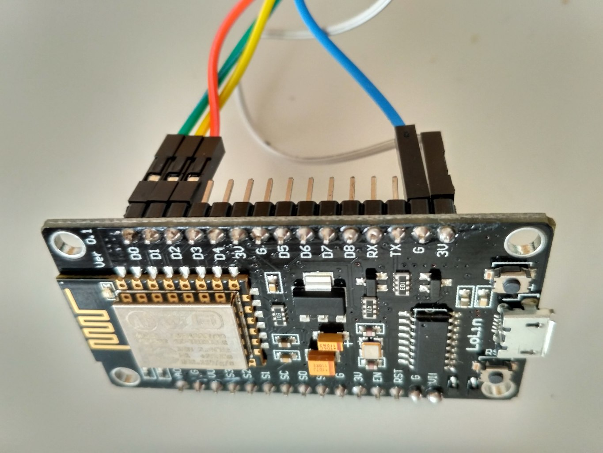
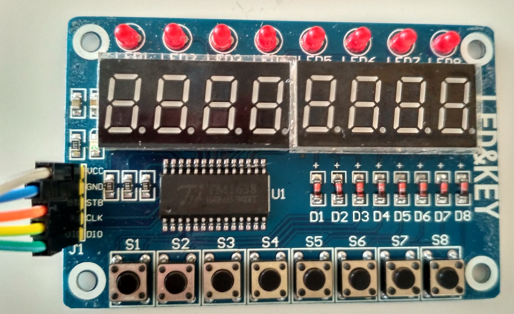

# HassMqqtAlarmPanelTM1638
ESP8266 and TM1638 based Alarm Panel

## Introduction

With the introduction of Home Assistant's MQTT Alarm Panel, it is very easy to create a WiFi enabled alarmpanel to arm and disarm your alarm.
Disarming the system is done by pushing S1. S2 will put the system in Arm Home mode. S3 in Arm Away. S4 in Arm Night.

## Libraries

### TM1638
The great tm1638 library can be found here and should be installed manually
https://github.com/rjbatista/tm1638-library/wiki

### PubSub
Can be found in the standard Arduino library
https://github.com/knolleary/pubsubclient

### User Config
Copy the userconfig-h.example file to userconfig.h and alter your WiFi credentials and broker address.

## Hardware
NodeMcu or Wemos D1 boards are cheap and already have a usefull powersupply. Any other ESP8266 (except for the ESP-01) can be used.
The TM1638 LED panel can be found at the usual eBay or Chinese providers.

## Wiring

Wire your panel as follows. GPIOs can be configured as needed in your configuration. For some EPS8266 systems, the use of D0,1 and 2 is not wanted.

|Panel|ESP |color|
|-----|----|-----|
|vcc  |3.3V|white|
|gnd  |GND|blue|   
|stb  |D2,GPIO16|orange|      
|clk  |D1,GPIO5|yellow|
|dio  |D0,GPIO4|green|




## MQTT
The default topic is set to home/alarm. The state and set parts are needed for Home Assistant. Every 60 seconds, a ALIVE message will be send to the default topic. This part can be used to add some sensors when needed.
When in Pending state, the LEDs will flash slow. In Triggered state, LEDs will flash fast. After 10 seconds the diplay will turn off.
Additional topics can be used to :
### publish
home/alarm/text : Set a Text to the display

home/alarm/led : Set the LEDs. Use a hex value. 00 will turn every LED off. FF will turn every LED on.

home/alarm/led : Set two values to display (ie. 20.180.9)

### subscribe
home/alarm/keys : When a button is pushed, the number of the corresponding button is published

## Home Assistant
Just add the following lines to your configuration.yaml and you are good to go
```
alarm_control_panel:
  - platform: manual_mqtt
    state_topic: home/alarm/state
    command_topic: home/alarm/set
    pending_time: 30
    armed_home:
      pending_time: 20
    triggered:
      pending_time: 20
    trigger_time: 4
    code: 1234
```
Check https://home-assistant.io/components/alarm_control_panel.manual_mqtt for details.